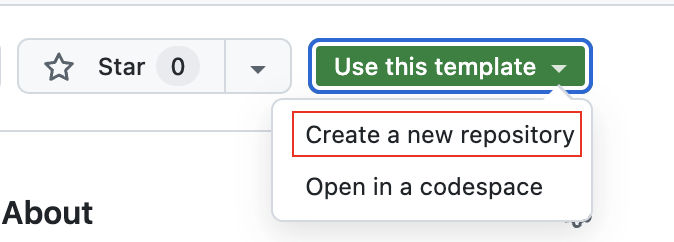

# Labo 01 – Client/Serveur, Persistence (DAO/RDBS/NoSQL)
    
ÉTS - LOG430 - Architecture logicielle - Chargé de laboratoire: Gabriel C. Ullmann, Automne 2025.    

## 🎯 Objectifs d’apprentissage

- Apprendre à créer une application **client-serveur** simple.
- Comprendre et mettre en œuvre la structure **MVC avec DAO** pour bien séparer les responsabilités.
- Comprendre les avantages et les inconvénients des bases de données relationnelles (ex. MySQL) par rapport aux bases « NoSQL » ou orientées à documents (ex. MongoDB).

--- 

## ⚙️ Setup
Dans ce laboratoire, vous développerez une application de gestion des utilisateurs et des articles pour un petit magasin. Il ne s'agit pas d'une application commerciale complète, mais elle offre une structure de base qui nous permettra d’expérimenter une architecture Client–Serveur sous une forme simplifiée.

> ⚠️ IMPORTANT : Avant de commencer le setup et les activités, veuillez lire la documentation architecturale dans le répertoire `/docs/arc42/docs.pdf`.

### 1. Clonez le dépôt
Créez votre propre dépôt à partir du dépôt gabarit (template). Vous pouvez modifier la visibilité pour la rendre privée si vous voulez.


Clonez votre dépôt sur votre ordinateur. Veillez à ne pas cloner le dépôt d'origine.
```bash
git clone https://github.com/[votre_nom_utilisateur]/log430-a25-labo1
cd log430-a25-labo1
```

### 2. Créez un fichier .env
Créez un fichier `.env` basé sur `.env.example`. Dans le fichier `.env`, utilisez les mêmes identifiants que ceux mentionnés dans `docker-compose.yml`.

> ⚠️ IMPORTANT : Si vous executez l'application sur votre ordinateur, utilisez les valeurs `localhost` ou `127.0.0.1` sur les variables `MYSQL_HOST` et `MONGODB_HOST`. Si vous executez l'application sur Docker, conservez les valeurs indiqués dans le fichier `.env.example.`. Dans un conteneur Docker, vous devez **toujours** indiquer le nom d'un conteneur (hostname) et non `localhost`.

### 3. Préparer l’environnement de développement
Suivez les mêmes étapes que dans le laboratoire 00. Cependant, ne lancez pas le conteneur de manière itérative initialement. Utilisez plutôt `docker build` pour créer tous les services, y compris les bases de données que nous utiliserons dans cet exemple. Si la création est réussie, démarrez le conteneur en mode détaché avec `docker compose up -d`, puis passez au mode interactif avec `docker compose exec`.
```bash
docker build -t labo1-store-manager .
docker compose up -d
docker compose exec store_manager_app python store_manager.py
```

### 4. Lancez l’application sur votre ordinateur

```bash
cd src
python store_manager.py
```

---

## 🧪 Activités pratiques

### 1. DAO MySQL

Le fichier `UserDAO` (dans `dao/user_dao.py`) contient déjà les méthodes `select_all()` et `insert(user)`.

Complétez cette DAO en y ajoutant :
   - `update(user)` – pour modifier un utilisateur existant.
   - `delete(user_id)` – pour supprimer un utilisateur.

> 💡 **Question 1** : Quelles commandes avez-vous utilisées pour effectuer les opérations UPDATE et DELETE dans MySQL ? Avez-vous uniquement utilisé Python ou également du SQL ? Veuillez inclure le code pour illustrer votre réponse.

#### Remarque : types de DAO
Il existe plusieurs manières d’implémenter une DAO. Par exemple, nous pourrions placer les opérations de base de données directement dans la classe Model. Dans notre cas, nous conservons la DAO et le Model séparés, comme décrit dans les ouvrages suivants : 
- 📘 Documenting Software Architectures: Views and Beyond, Clements et al., 2010, p. 97.
- 📕 Core J2EE Patterns: Best Practices and Design Strategies, Alur et al., 2001, p. 252.

### 2. DAO MongoDB

Créez une nouvelle DAO `UserDAOMongo` dans un fichier `dao/user_dao_mongo.py`.

Implémentez les mêmes méthodes :
   - `select_all()`
   - `insert(user)`
   - `update(user)`
   - `delete(user_id)`

Modifiez la méthode `__init__` pour vous connecter à MongoDB au lieu de MySQL. Utilisez la bibliothéque `pymongo` et la variable d'environnement `MONGODB_HOST`.

Modifiez `test_user.py` pour utiliser `UserDAOMongo` en lieu de `UserDAO`, puis relancez les tests. Une implémentation correcte doit produire les mêmes résultats, en considérant que quelques ajustements mineurs dans les tests peuvent être nécessaires pour assurer l’interchangeabilité des DAO.

> 💡 **Question 2** : Quelles commandes avez-vous utilisées pour effectuer les opérations dans MongoDB ? Avez-vous uniquement utilisé Python ou également du SQL ? Veuillez inclure le code pour illustrer votre réponse.

### 3. Nouveau tableau : Products
Insérez le code SQL pour créer le tableau `products` dans `db-init/init.sql`. Ce fichier sera executé a chaque fois qu'on démarre la conteneur.
```sql
CREATE TABLE IF NOT EXISTS products (
    id INT AUTO_INCREMENT PRIMARY KEY,
    name VARCHAR(80) NOT NULL,
    brand VARCHAR(20) NOT NULL,
    price DECIMAL(10, 2) NOT NULL
);
```

Créez un nouvel Model, View, Controller et DAO pour `Product`. Utilisez une structure MVC similaire à `User`. Ajoutez les options `Montrer la liste d'items` et `Ajouter un item` dans `product_view.py`. Vous pouvez également ajouter une option de `Supprimer un item` au menu (facultatif). Si vous voulez, créez une classe `View` séparée uniquement pour imprimer toutes les options de menu. Veuillez utiliser les diagrammes UML disponibles dans le dossier `docs/views` comme référence pour l’implémentation.

> 💡 **Question 3** : Comment avez-vous implémenté votre `product_view.py` ? Est-ce qu’il importe directement la `ProductDAO` ? Veuillez inclure le code pour illustrer votre réponse.

> 💡 **Question 4** : Si nous devions créer une application permettant d’associer des achats d'articles aux utilisateurs (`Users` → `Products`), comment structurerions-nous les données dans MySQL par rapport à MongoDB ?


### ✅ Correction des activités

Des tests unitaires sont inclus dans le dépôt. Pour les exécuter :

```bash
python3 -m pytest
```

Si tous les tests passent ✅, vos implémentations sont correctes.

---

## 📦 Livrables

- Code compressé en `.zip` contenant **l'ensemble du code source** du projet Labo 01.
- Rapport `.pdf` répondant aux 4 questions presentées dans ce fichier. Il est **obligatoire** d'ajouter du code ou des sorties de terminal pour illustrer chacune de vos réponses.

