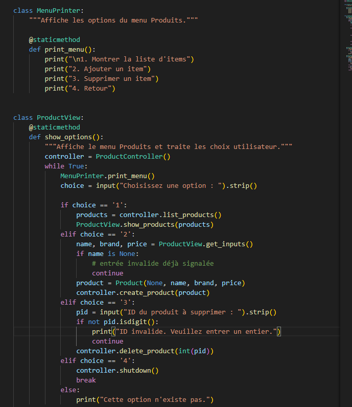
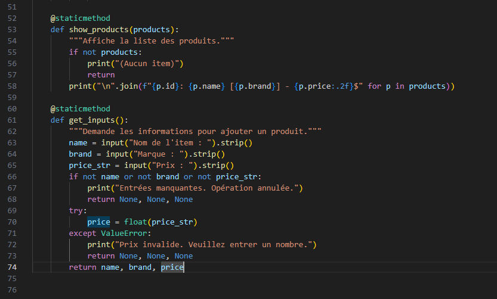
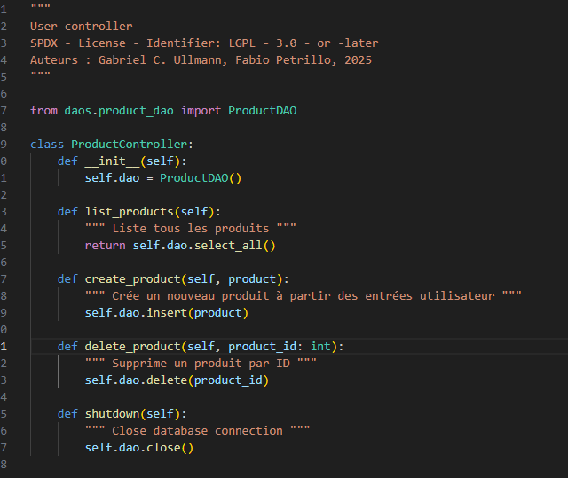

# Labo XX — Rapport

 \
[Prénom Nom de l’étudiant·e] \
Rapport de laboratoire \
LOG430 — Architecture logicielle \
[Lieu et date de dépôt] \
École de technologie supérieure

## Questions

### Question 1

Question 1:
Python est utilisé pour la connexion, le passage d’arguments et le commit.
SQL (requêtes UPDATE et DELETE) est exécuté via cursor.execute(...) avec des placeholders %s.
Cette combinaison garantit sécurité (paramétrage), clarté et conformité aux bonnes pratiques.
 
Les identifiants et le host sont fournis à l’application via variables d’environnement (injectées par Docker Compose) et lus avec os.getenv. Ensuite, la connexion est ouverte et un curseur est créé . Comme les variables sont déjà présentes dans l’environnement du conteneur (via env_file/environment dans docker-compose.yml), load_dotenv n’est plus nécessaire.

L’update et le delete utilisent une requête SQL paramétrée (placeholders %s) pour éviter l’injection et déléguer l’échappement/typage au driver.

 

### Question 2
Nous n’avons pas utilisé de SQL avec MongoDB. Toutes les opérations CRUD ont été faites en Python via la bibliothèque pymongo.
Les “commandes” sont donc des appels d’API Python: insert_one, find, update_one (avec l’opérateur $set), delete_one et delete_many.
Exemples extraits de user_dao_mongo.py:

Connexion à MongoDB (avec variables d’environnement)

On construit une URI; si des identifiants sont fournis, on utilise authSource=admin (cas par défaut des images Docker):

Mise à jour — update_one avec opérateur $set (l’id doit être converti en ObjectId):
ObjectId(...) lève une erreur si la chaîne n’est pas un identifiant valide; il est préférable de valider/convertir proprement avant l’appel.
Dans Docker, si l’utilisateur n’est pas créé dans la base admin, il faut ajuster authSource vers la base qui détient l’utilisateur.

### Question 3

J’ai implémenté product_view.py en respectant le pattern MVC: la vue ne parle pas directement à la base de données. Elle utilise un contrôleur, qui lui délègue au DAO.
Donc, non: product_view.py n’importe pas directement la ProductDAO. Elle importe le ProductController, et le contrôleur utilise la ProductDAO. Ce choix garde une bonne séparation des responsabilités, facilite les tests et permet d’échanger la DAO (ex. MySQL → Mongo) sans toucher à la vue.

La vue affiche un menu (liste/ajout/suppression), récupère les entrées utilisateur, les valide, et appelle le contrôleur.

Le contrôleur encapsule la ProductDAO et expose des méthodes de haut niveau à la vue.

## Observations additionnelles

- Observations sur d’éventuels problèmes de setup ou de code rencontrés lors de l’exécution des activités (optionel).
- Particularités de votre configuration CI/CD (ex. : utilisation d’une VM, d’un service infonuagique comme Azure, etc.).
